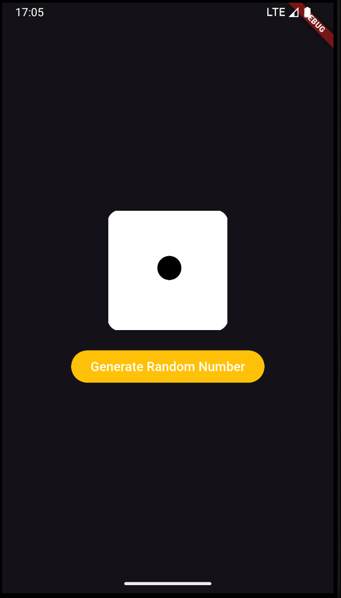

# Meeting 4: Stateful Widget - Aplikasi Dadu

## Deskripsi
Pada pertemuan ke-4 ini, kita akan membahas tentang Stateful widget di Flutter dengan membuat sebuah aplikasi dadu sederhana. Aplikasi ini akan menampilkan gambar dadu yang berubah setiap kali tombol ditekan.


 
## Struktur Folder
Kali ini, kita menambahkan folder baru, yaitu
`assets`. Isinya adalah gambar dadu yang akan kita
tampilkan di dalam aplikasi. Agar flutter mengetahui
ada folder yang kita tambahkan, kita perlu
untuk mengubah `pubspec.yaml`


```
flutter:
  uses-material-design: true
  assets:
    - assets/
```

Tambahkan `assets/` pada bagian `flutter:` dan 
perhatikan indentasi, karena YAML sangat memperhatikannya.


## Tujuan
- Memahami konsep Stateful widget di Flutter.
- Mempelajari cara mengelola state dalam aplikasi Flutter.
- Mengimplementasikan logika untuk menghasilkan angka acak dan menampilkan gambar dadu yang sesuai.

## Penjelasan Kode
File utama untuk aplikasi ini adalah `lib/main.dart`. Berikut adalah penjelasan singkat tentang kode yang ada di file tersebut:

- `MainApp` adalah Stateful widget yang menjadi titik masuk aplikasi.
- `_MainAppState` adalah state dari MainApp yang mengelola state `_randomNumber`.
- `generateRandomNumber` adalah fungsi yang menghasilkan angka acak antara 1 hingga 6 dan memperbarui state `_randomNumber`.
- Pada build method, kita menampilkan gambar dadu berdasarkan nilai `_randomNumber` dan sebuah tombol untuk menghasilkan angka acak baru.