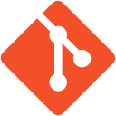
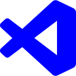

# Software Development Setup and "Hello World"

Pada pertemuan ke-2, anggota MAD mempersiapkan kebutuhan
software yang ingin diinstall untuk membuat aplikasi mobile.
Dikarenakan persiapan software yang dapat dikatakan sulit, meeting ini diadakan untuk membantu peserta MAD untuk menginstall software yang dibutuhkan.

## Requirements
<table>
  <tr>
    <th>Software</th>
    <th>Link</th>
  </tr>
  <tr>
    <td align="center"> Android Studio</td>
    <td><a href="https://developer.android.com/studio">https://developer.android.com/studio</a></td>
  </tr>
  <tr>
    <td align="center"> Flutter</td>
    <td><a href="https://docs.flutter.dev/get-started/install">https://docs.flutter.dev/get-started/install</a></td>
  </tr>
  <tr>
    <td align="center" > Git</td>
    <td><a href="https://git-scm.com/downloads">https://git-scm.com/downloads</a></td>
  </tr>
  <tr>
    <td align="center"> Visual Studio Code</td>
    <td><a href="https://code.visualstudio.com/download">https://code.visualstudio.com/download</a></td>
  </tr>
</table>

## Tutorial
Tekan gambar di bawah ini.  

